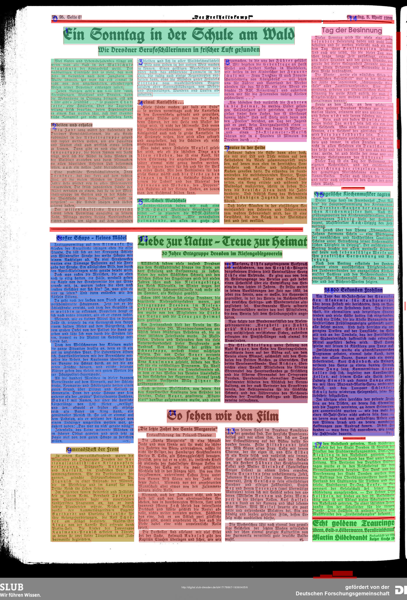

# Segment_articles

This project trys to segment articles on a testsample of the Nazi Newspaper "Freiheitskampf" [see](https://hait.tu-dresden.de/ext/forschung/der-freiheitskampf.asp).

# Steps

## Combine Machine Learning and rule-based methods
To assign segmentation to full articles within the Nazi newspaper, we use a combination of machine learning (ML) tools and rule-based methods. With the ML tool Eynollah a first segmentation of different text regions and a rough recognition of the reading order can be performed. With certain rules (like pixel spacing or average line heights) the segmentation will be extended to recognize complete articles. 

## Cropping
To make Eynollah's segmentation work better, the original scans were cropped and 85 pixels were cut off on the left and right, because Eynollah always recognized a column of text from the next or the previous page, which messed up the reading order. 

## Combine the Textregions
This is the step that requires a strong heuristic approach. In the Jupyter notebook "Color_segments" you can find the corresponding code. 
Here, all text regions recognized by Eynollah are first colored and the reading order recognized by Eynollah is indicated by a small in the upper left corner of the rectangles. Some functions are used to delete certain regions, merge regions by column, and detect multi-column headings. These steps can be further customized.
The order of the steps looks something like this:
- The process was divided into roughly two steps. First, everything that belongs together in a column should be detected (including single-column headings, excluding multi-column headings). Then, multi-column headings were recognized and the corresponding text regions were assigned
- First, multiple regions in a column were merged together. A region started again when the distance between two paragraphs exceeds a certain value, or a one-liner comes (most likely heading)
- Multiline single-column headings were recognized with a separate function
- next, multi-column headings were detected. This was done by detecting the average line height of the text regions. If a line is 20% higher than the average line and wider than 350 pixels, it was detected as a multi-column heading.
- Then all text regions under a multi-column region were merged into one article. There are functions that detect whether a text region next encounters a border, i.e. a separator, a new multi-column heading or the end of the page.
- tbd: If an article continues next to the headline and is no longer at the same height, it has not yet been assigned to the appropriate article.

Text lines recognized by Eynollah were also marked with small red rectangles.
The current progress of the segmentation can be seen in the folder "croped_colored".

## OCR

Tbd
(Idea: use Calamari)
