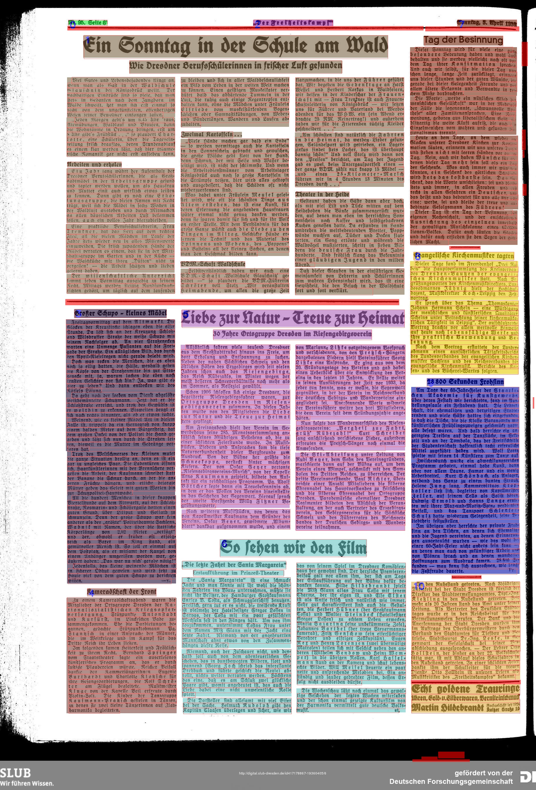

# Segment_articles

This project trys to segment articles on a testsample of the Nazi Newspaper "Freiheitskampf" [see](https://hait.tu-dresden.de/ext/forschung/der-freiheitskampf.asp).

# Steps

## Cropping
To make Eynollah's segmentation work better, the original scans were cropped and 85 pixels were cut off on the left and right, because Eynollah always recognized a column of text from the next or the previous page, which messed up the reading order. 

## Combine the Textregions
This is the step which requires a strong heuristic approach. In the Jupyter notebook "Color_segments" you can find the corresponding code. 
Here, first all text regions recognized by Eynollah are marked in color and the reading order recognized by Eynollah is indicated with a small one in the upper left corner of the rectangles. With some functions certain regions are deleted, column-wise regions are merged and multi-column headings are recognized. These steps can be further customized.
Textlines recognized by Eynollah were also marked with small red rectangles.
The current progress of the segmentation can be viewed in the folder "croped_colored".

## OCR

Tbd
